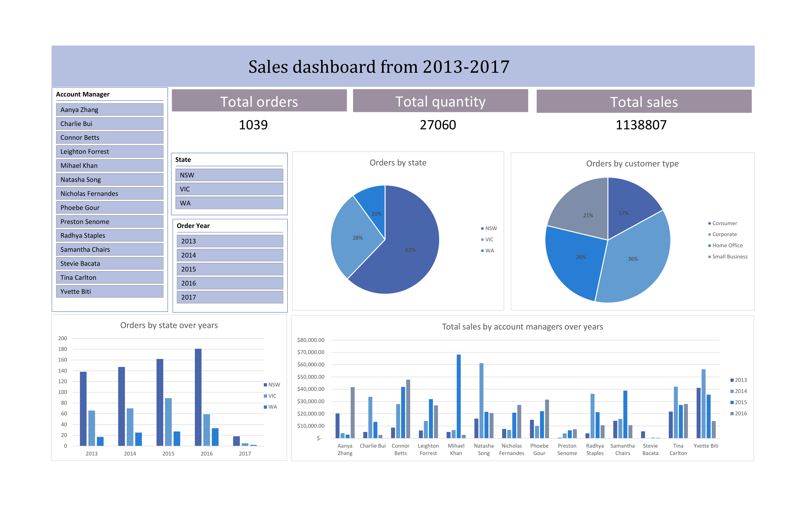
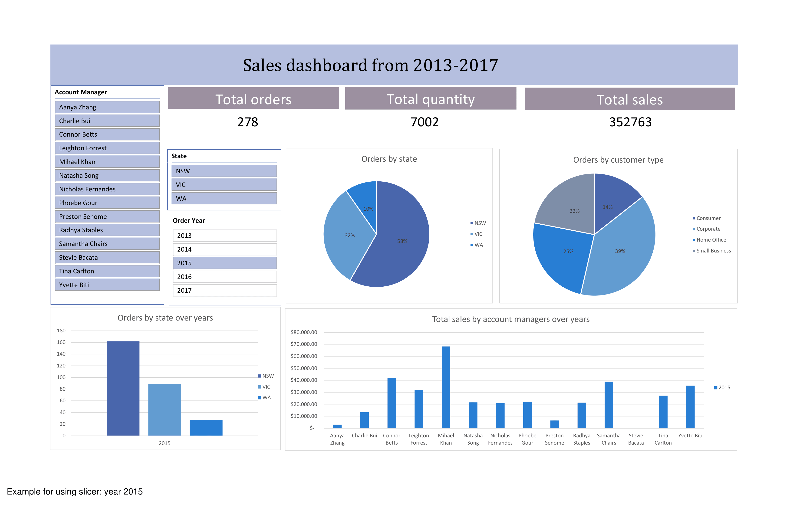

# Australian Retail Sales Analysis
Interactive and static sales dashboards built in Microsoft Excel, completed during my summer data analysis internship at **Konecta** (2025). The dataset is a synthetic retail sales dataset provided for training purposes.

## Overview

The dataset covers three Australian states (NSW, VIC, WA) from 2013 to 2017, with 1,039 orders, 27,060 units sold, $1.13 million in total sales, 14 account managers, and four customer segments. The project had two deliverables: a static summary dashboard and a fully interactive one with slicers for filtering by year, state, and account manager.

## Dashboards

Covers overall KPIs, state and segment distribution via pie charts, a year by state combo chart, and an account manager table with sparkline trends for 2013–2016.

The same metrics made filterable via slicers for year, state, and account manager. All charts and KPI cards update dynamically. The third image shows it filtered to 2015 as a usage example.

## Insights

- NSW made up 62% of all orders throughout the entire period
- Sales peaked in 2015 at $352,763 then declined to $272,289 in 2016
- Yvette Biti had the highest total sales overall but a clear downward trend by 2016
- Connor Betts showed the opposite pattern, growing consistently year on year
- Corporate was the largest customer segment at 36%, with Consumer the smallest at 17%
